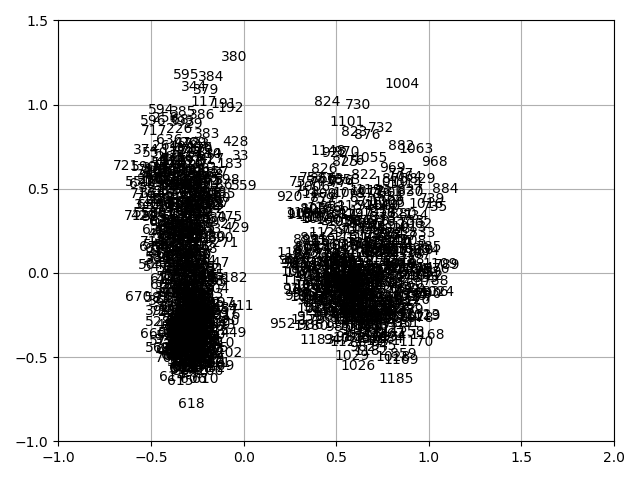

# About

> @ author stan

- Dataset : data driven dengue
- For extract the correlation of dataset and get pca with fixed field.

## Conclusions

- The feature reanalysis_dew_point_temp_k and feature reanalysis_specific_humidity_g_per_kg hascorrelation and its value is 0.997051293201
- The feature reanalysis_specific_humidity_g_per_kg and feature reanalysis_dew_point_temp_k hascorrelation and its value is 0.997051293201
- The feature reanalysis_max_air_temp_k and feature reanalysis_tdtr_k hascorrelation and its value is 0.918578257692
- The feature reanalysis_tdtr_k and feature reanalysis_max_air_temp_k hascorrelation and its value is 0.918578257692
- The feature reanalysis_air_temp_k and feature reanalysis_avg_temp_k hascorrelation and its value is 0.901777444717
- The feature reanalysis_avg_temp_k and feature reanalysis_air_temp_k has correlation and its value is 0.901777444717
- The image of pca. Which means the high dimension data can be divided by reflecting to 2 dimension space. Which this maybe useful for advanced clustering.

