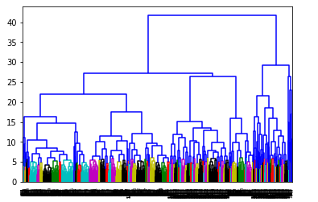
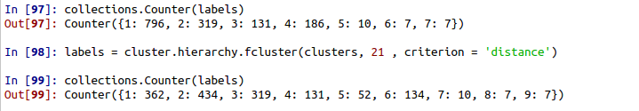
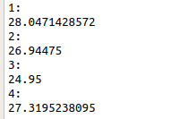

# About

> @ author stan

- Dataset : data driven dengue
- Hierarchical clustering and visualize  data with dendrogram 

# Brief Flow Introduction

- load data and simply clean data

- data normalization

- calculate similarity matrix

- Build dendrogram, and from the image we can pick a value between 20 - 25 for we need 4 clusters which it has reality meaning reference. Then pick 22 as the cut point from the picture below.

  

  

- Match 4 label with group by watching temperature. the data.​
