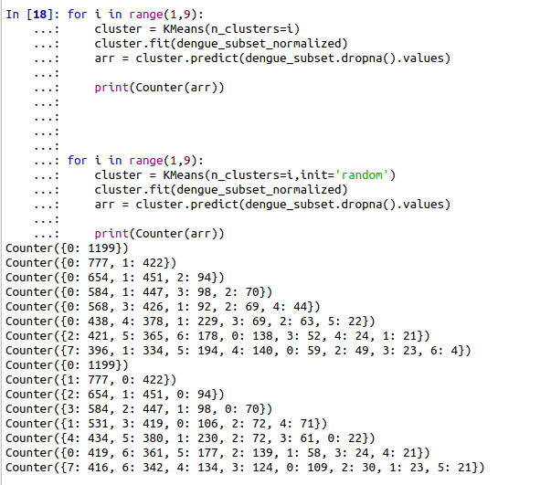
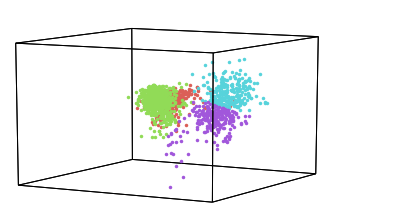
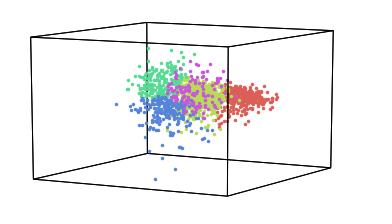

# About

> @ author stan

- Dataset : data driven dengue
- Cluster data with kmeans

## Brief Flow Introduction

- load data and clean,remove unused field
- normalization
- cluster with random and  default('kmeans++') init method
- check the data with iteration, choose 4 or 5 as n_clusters

- visualize it and pick 4 as cluster numbers

  

  Above is while n_clusters = 4. Picture below is n_clusters=5. Obviously 4 is better than 5.

- 