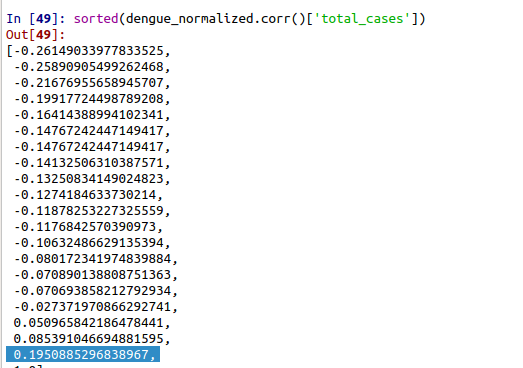
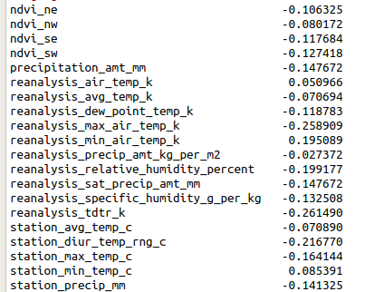

# About

> @ author stan

- Dataset : data driven dengue
- Hierarchical clustering and visualize  data with dendrogram 

# Brief Flow Introduction

- load data and simply clean data

- data normalization

- correlation between labels and others

- 

  

- Features selection

  pick the fields with top ranked correlation with label

- result:
  pdf file in this repository