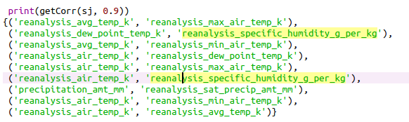
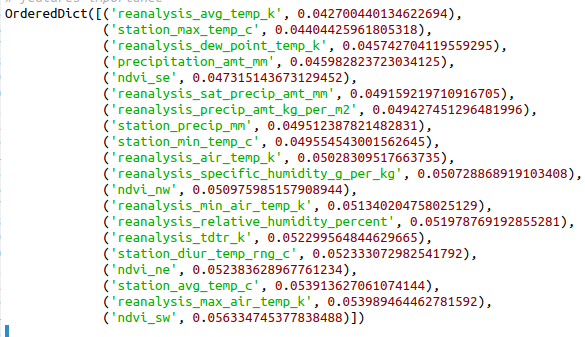
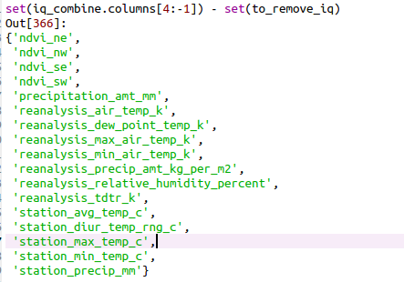
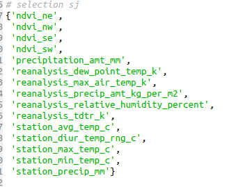

# About

> @ author stan

- Dataset : data driven dengue
- Preparation for submit to competition site

# Brief  Introduction

- load data and simply clean data

- split data by key 'city'

- calculate correlation between for each city's data, and remove one if correlation between 2 features is too high.

  ​	

- calculate feature weights by decision tree. Remove if it's too low.

  

- Then get the rest features for different city.

  

  and 

  

- And after get features selection, the result get 1.4 points promotion.