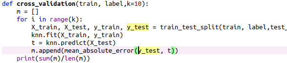
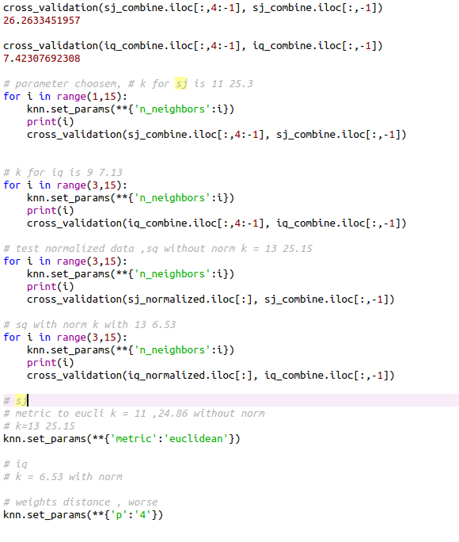
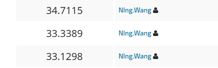

# About

> @ author stan

- Dataset : data driven dengue
- Submit to website

# Brief Flow Introduction

- Load data

- Handle data's na by

- Cross validation

  created a method for display the result in different parameter.

  

- Loop test validation with different parameter for KNN with normalized/unnormalized. 

  

- Pick parameter with low MAE

  
